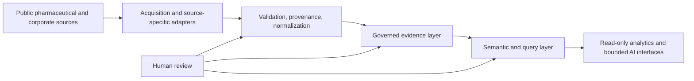

# PharmacyDB Portfolio

A sanitized portfolio case study showing how I approach business systems analysis, workflow automation, data quality, and governed analytics in a pharmaceutical-data context.

This public repository is intentionally separate from the private implementation repository. It contains no credentials, private cloud identifiers, raw restricted source artifacts, or production secrets.

## What problem does PharmacyDB address?

Pharmaceutical market and product questions often require evidence from multiple public sources that were not designed to work together. Pricing, product identity, regulatory events, and financial context may use different identifiers, update cycles, and levels of detail.

The project explores how to turn those disconnected sources into a controlled analytical workflow by making source authority, identity, provenance, validation, and human-review boundaries explicit.

## Business analysis view

The project is structured around a repeatable BA workflow:

1. Define the business question and scope.
2. Identify authoritative source systems and limitations.
3. Map current-state data flows and dependencies.
4. Define governed identities, joins, and business rules.
5. Translate requirements into data models, workflows, and validation rules.
6. Test outputs against acceptance criteria.
7. Publish only approved, read-only analytical views.
8. Route ambiguous mappings or unsupported conclusions to human review.

## High-level architecture

Example source domains include public pricing benchmarks, FDA regulatory data, product/package identity data, and controlled financial evidence.

## What this project demonstrates

- Business requirements analysis and functional decomposition
- Current-state and future-state process thinking
- Data-source authority and provenance controls
- Product and package identity governance
- SQL and data-model design
- Python-based validation and automation
- API and workflow integration concepts
- Deterministic testing and replay checks
- Read-only semantic/query layers
- Human-review gates for ambiguous mappings
- Fail-closed behavior when authority or identity is insufficient

## Verified project scale snapshot

One validated schema inventory in the private implementation documented:

- 4 named target datasets available
- 76 target data objects
- 1,739 live columns
- 38 parsed view dependencies
- a governed 48-package NDC11 identity set with no duplicate or invalid NDC11 values in that bounded set

These figures describe a validated project snapshot, not a claim of full-market coverage.

## Technology evolution

The project evolved through several implementation stages rather than starting with one fixed architecture.

| Area | Technologies / approach |
|---|---|
| Data acquisition and automation | Python, APIs, web-based source intake, workflow automation concepts including n8n |
| Earlier application/data layer | PostgreSQL, FastAPI |
| Current governed analytical layer | Google BigQuery, SQL, structured evidence and semantic views |
| Validation | Python tests, deterministic validators, hashes, replay and schema checks |
| Delivery discipline | Git, GitHub, controlled changes, documented acceptance and release boundaries |

Earlier technologies are retained as project history; they are not represented here as a single live production stack.

## Case-study documents

- [Business case and solution approach](docs/CASE_STUDY.md)
- [Business analysis artifacts and decision model](docs/BUSINESS_ANALYSIS.md)
- [Sanitized architecture](docs/ARCHITECTURE.md)
- [Validation and acceptance approach](docs/VALIDATION.md)

## Portfolio boundary

This repository is a professional case study, not a production pharmaceutical system. It does not provide clinical, prescribing, reimbursement, or autonomous decision support. It also does not expose the private implementation repository or its controlled source artifacts.
