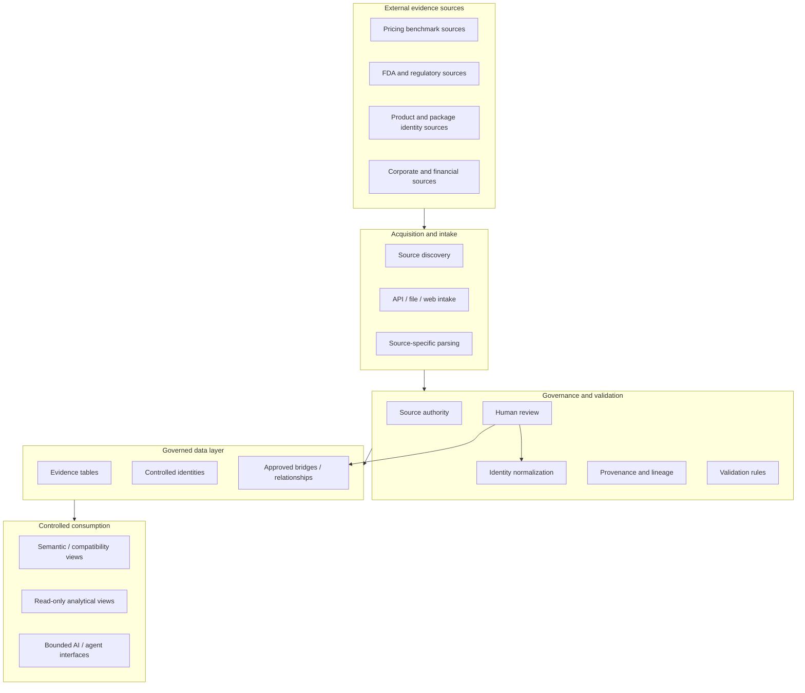
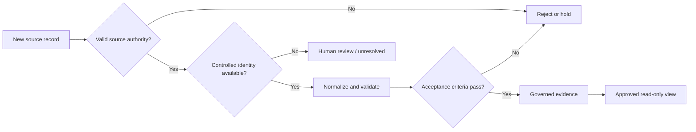

# Sanitized Architecture

## Purpose

This document shows the system-design thinking behind PharmacyDB without exposing private implementation details, cloud identifiers, credentials, source archives, or restricted configuration.

## Logical architecture



## Why the architecture is layered

The design separates evidence collection from interpretation.

That separation supports several business requirements:

- a source record can remain available even if a downstream mapping is unresolved;
- an analytical view can change without rewriting source evidence;
- competing source meanings are not silently collapsed;
- approved consumers can be restricted to read-only interfaces;
- proposed relationships can be reviewed before entering governed outputs.

## Example data-flow decision



## Integration principles

### Source-specific adapters

Different sources are parsed independently because schema, timing, identifiers, and business meaning vary by source. Standardization occurs only after source-specific validation.

### Controlled identifiers

Where a controlled key exists, it is preferred to string or name matching. For pharmaceutical packages, NDC11 is one important identifier, but the broader project also distinguishes product, application, entity, and event identities.

### Read-only consumption

Downstream analytical and bounded AI interfaces are designed around approved read-only views rather than direct unrestricted access to every evidence table.

### Human-in-the-loop boundaries

Ambiguous entity, product, application, or event relationships are not treated as deterministic merely because two records look similar. Human-review states are part of the system design.

## Technology map

```text
Public sources
   ↓
Python / APIs / controlled source intake
   ↓
Validation + normalization + provenance
   ↓
BigQuery governed evidence
   ↓
SQL semantic and analytical views
   ↓
Read-only reporting / bounded AI interfaces
```

Earlier project stages also used PostgreSQL, FastAPI, n8n, Render/Neon, and Power BI. They represent prior implementation exploration and are not presented as one current production stack.

## Architecture constraints

The private implementation applies controls such as explicit source authority, additive-change preference, prohibited-operation checks, deterministic validation, and approval boundaries. This public document summarizes those patterns without publishing private environment details.
